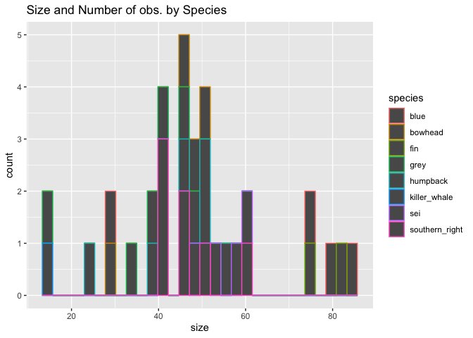

# Lab 6

``` r
# Load required packages
library(tidyverse)
library(knitr)

# Read in the data
whales <- read_csv("https://raw.githubusercontent.com/nt246/NTRES-6100-data-science/main/datasets/whales.csv")
whales |> head() |> kable()
```

| observer | blue                     | humpback                     | southern_right               | sei                         | fin                       | killer_whale | bowhead                    | grey                      |
|---------:|:-------------------------|:-----------------------------|:-----------------------------|:----------------------------|:--------------------------|:-------------|:---------------------------|:--------------------------|
|        1 | 1/20/15, death, , Indian | NA                           | NA                           | 8/9/11, injury, , indian    | NA                        | NA           | NA                         | NA                        |
|        2 | NA                       | 8/12/15, death, 50, atlantic | NA                           | NA                          | 8/2/13, death, 76, arctic | NA           | 6/24/13, injury, 30, artic | NA                        |
|        3 | NA                       | NA                           | 7/14/13, injury, 47, pacific | NA                          | NA                        | NA           | NA                         | NA                        |
|        4 | NA                       | 3/4/12, death, 56, pacific   | NA                           | NA                          | NA                        | NA           | NA                         | 5/24/16, death, , pacific |
|        5 | NA                       | NA                           | NA                           | 6/14/12, injury, 52, indian | NA                        | NA           | NA                         | NA                        |
|        6 | 5/2/16, , 80, pacific    | NA                           | NA                           | NA                          | NA                        | NA           | NA                         | NA                        |

**Question 1. Create a new data frame that has one row per observer, per
species and one single variable of all the information collected. Name
this data frame `whales_long`.**

``` r
whales_long <- whales |> 
pivot_longer(c("blue","humpback","southern_right", "sei","fin",
               "killer_whale","bowhead","grey"),names_to = "species") 

whales_long |> 
head() |> 
kable()
```

| observer | species        | value                    |
|---------:|:---------------|:-------------------------|
|        1 | blue           | 1/20/15, death, , Indian |
|        1 | humpback       | NA                       |
|        1 | southern_right | NA                       |
|        1 | sei            | 8/9/11, injury, , indian |
|        1 | fin            | NA                       |
|        1 | killer_whale   | NA                       |

**Question 2. Starting from `whales_long`, create another data frame
that includes only events for which there is information. Name this data
frame `whales_clean`.**

``` r
whales_clean <- whales_long |> drop_na() 

whales_clean |> 
  head() |> 
  kable()
```

| observer | species        | value                        |
|---------:|:---------------|:-----------------------------|
|        1 | blue           | 1/20/15, death, , Indian     |
|        1 | sei            | 8/9/11, injury, , indian     |
|        2 | humpback       | 8/12/15, death, 50, atlantic |
|        2 | fin            | 8/2/13, death, 76, arctic    |
|        2 | bowhead        | 6/24/13, injury, 30, artic   |
|        3 | southern_right | 7/14/13, injury, 47, pacific |

**Question 3. Starting from `whales_clean`, create another data frame
with one variable per type of information, one piece of information per
cell. Some cells might be empty. Name this data frame `whales_split`.**

``` r
whales_split <- whales_clean |> 
separate(value,into=c("date","outcome","size","ocean"),sep = ",") 

whales_split |> 
  head() |> 
  kable()
```

| observer | species        | date    | outcome | size | ocean    |
|---------:|:---------------|:--------|:--------|:-----|:---------|
|        1 | blue           | 1/20/15 | death   |      | Indian   |
|        1 | sei            | 8/9/11  | injury  |      | indian   |
|        2 | humpback       | 8/12/15 | death   | 50   | atlantic |
|        2 | fin            | 8/2/13  | death   | 76   | arctic   |
|        2 | bowhead        | 6/24/13 | injury  | 30   | artic    |
|        3 | southern_right | 7/14/13 | injury  | 47   | pacific  |

**Question 4. Starting from `whales_split`, create another data frame in
which all columns are parsed as instructed below. Name this data frame
`whales_parsed`.**

The columns should parsed to the following types \* observer: double \*
species: character \* date: date \* outcome: character \* size: integer
\* ocean: character

``` r
whales_parsed <- whales_split |> 
mutate(date=parse_date(date, "%m/%d/%y")) |> 
mutate(size=parse_integer(size)) 

whales_parsed |> 
head()|> 
kable()
```

| observer | species        | date       | outcome | size | ocean    |
|---------:|:---------------|:-----------|:--------|-----:|:---------|
|        1 | blue           | 2015-01-20 | death   |   NA | Indian   |
|        1 | sei            | 2011-08-09 | injury  |   NA | indian   |
|        2 | humpback       | 2015-08-12 | death   |   50 | atlantic |
|        2 | fin            | 2013-08-02 | death   |   76 | arctic   |
|        2 | bowhead        | 2013-06-24 | injury  |   30 | artic    |
|        3 | southern_right | 2013-07-14 | injury  |   47 | pacific  |

**Question 5. Using whales_parsed, print a summary table with: 1) number
ship strikes by species, 2) average whale size by species, omitting NA
values in the calculation.**

``` r
whales_parsed |> 
group_by(species) |> 
summarize(strikes_per_species=n()) |> 
kable()
```

| species        | strikes_per_species |
|:---------------|--------------------:|
| blue           |                   5 |
| bowhead        |                   5 |
| fin            |                   4 |
| grey           |                   7 |
| humpback       |                   7 |
| killer_whale   |                   2 |
| sei            |                   5 |
| southern_right |                   7 |

``` r
whales_parsed |> 
drop_na() |> 
group_by(species) |> 
summarize(average_size=mean(size)) |> 
kable()
```

| species        | average_size |
|:---------------|-------------:|
| blue           |     67.50000 |
| bowhead        |     43.75000 |
| fin            |     78.50000 |
| grey           |     36.83333 |
| humpback       |     44.33333 |
| killer_whale   |     15.00000 |
| sei            |     54.75000 |
| southern_right |     47.00000 |

**Question 6. Try to summarize as much information contained in
`whales_parsed` as possible in one plot.**

``` r
whales_parsed |> 
select(-observer) |> 
group_by(species) |> 
ggplot()+
geom_histogram(mapping=aes(x=size,color=species)) + 
labs (title = "Size and Number of obs. by Species")
```

    `stat_bin()` using `bins = 30`. Pick better value with `binwidth`.

    Warning: Removed 8 rows containing non-finite outside the scale range
    (`stat_bin()`).



I was unable to use ocean as a facet wrap like I wanted to because the
way the ocean names are spelled is inconsistent. I also couldn’t use
years as a facet because the data is recorded in individual days.
