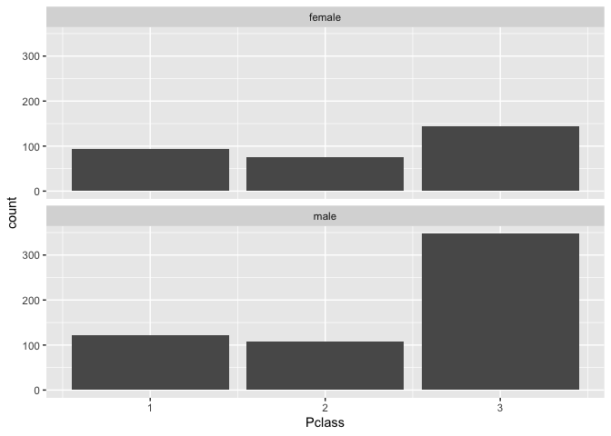
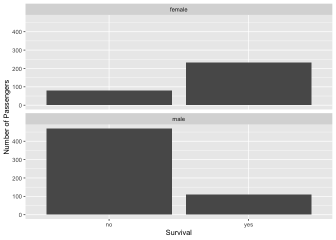
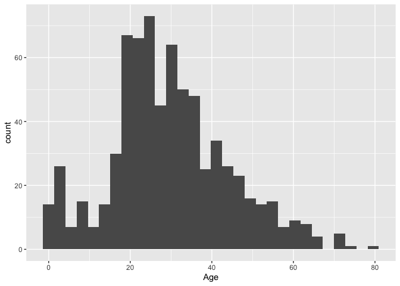

# Lab 5

``` r
titanic_total_count <- titanic |> count() 
#We know about 891 passengers and crew
```

``` r
titanic_survived <- titanic |> filter(Survived =="1") |> count() 

#342 survived

titanic_not_survived <- titanic |> filter(Survived =="0") |> count() 

#549 did not
```

``` r
survival_rate=titanic_survived/titanic_total_count

#Survival rate was 38%
```

``` r
titanic |> 
group_by(Sex,Pclass) |> 
ggplot() +
geom_bar(mapping = aes(x=Pclass)) +
facet_wrap(~Sex,nrow=2)
```



``` r
titanic |> 
group_by(Sex,Survived) |> 
  mutate(Survived = ifelse(Survived==0, "no", "yes")) |> 
ggplot() +
geom_bar(mapping = aes(x=Survived))+
facet_wrap(~Sex,nrow=2) + labs(x="Survival", y="Number of Passengers")
```



``` r
titanic |> 
filter(Age != "NA") |> 
#count() |> 
ggplot() + geom_histogram(aes(x=Age))
```

    `stat_bin()` using `bins = 30`. Pick better value with `binwidth`.


