# lab7

``` r
# Load required packages
library(tidyverse)
```

    Warning: package 'ggplot2' was built under R version 4.3.3

    ── Attaching core tidyverse packages ──────────────────────── tidyverse 2.0.0 ──
    ✔ dplyr     1.1.2     ✔ readr     2.1.4
    ✔ forcats   1.0.0     ✔ stringr   1.5.0
    ✔ ggplot2   3.5.2     ✔ tibble    3.2.1
    ✔ lubridate 1.9.2     ✔ tidyr     1.3.0
    ✔ purrr     1.0.1     
    ── Conflicts ────────────────────────────────────────── tidyverse_conflicts() ──
    ✖ dplyr::filter() masks stats::filter()
    ✖ dplyr::lag()    masks stats::lag()
    ℹ Use the conflicted package (<http://conflicted.r-lib.org/>) to force all conflicts to become errors

``` r
library(knitr)
```

    Warning: package 'knitr' was built under R version 4.3.3

``` r
library(nycflights13) # install.packages("nycflights13")

flights |> head() |> kable()
```

| year | month | day | dep_time | sched_dep_time | dep_delay | arr_time | sched_arr_time | arr_delay | carrier | flight | tailnum | origin | dest | air_time | distance | hour | minute | time_hour           |
|-----:|------:|----:|---------:|---------------:|----------:|---------:|---------------:|----------:|:--------|-------:|:--------|:-------|:-----|---------:|---------:|-----:|-------:|:--------------------|
| 2013 |     1 |   1 |      517 |            515 |         2 |      830 |            819 |        11 | UA      |   1545 | N14228  | EWR    | IAH  |      227 |     1400 |    5 |     15 | 2013-01-01 05:00:00 |
| 2013 |     1 |   1 |      533 |            529 |         4 |      850 |            830 |        20 | UA      |   1714 | N24211  | LGA    | IAH  |      227 |     1416 |    5 |     29 | 2013-01-01 05:00:00 |
| 2013 |     1 |   1 |      542 |            540 |         2 |      923 |            850 |        33 | AA      |   1141 | N619AA  | JFK    | MIA  |      160 |     1089 |    5 |     40 | 2013-01-01 05:00:00 |
| 2013 |     1 |   1 |      544 |            545 |        -1 |     1004 |           1022 |       -18 | B6      |    725 | N804JB  | JFK    | BQN  |      183 |     1576 |    5 |     45 | 2013-01-01 05:00:00 |
| 2013 |     1 |   1 |      554 |            600 |        -6 |      812 |            837 |       -25 | DL      |    461 | N668DN  | LGA    | ATL  |      116 |      762 |    6 |      0 | 2013-01-01 06:00:00 |
| 2013 |     1 |   1 |      554 |            558 |        -4 |      740 |            728 |        12 | UA      |   1696 | N39463  | EWR    | ORD  |      150 |      719 |    5 |     58 | 2013-01-01 05:00:00 |

Question 1: Compute the average delay by destination, then join on the
airports data frame so you can show the spatial distribution of delays.
Here’s an easy way to draw a map of the United States:

``` r
library(maps) #install.packages("maps")
```

    Warning: package 'maps' was built under R version 4.3.3


    Attaching package: 'maps'

    The following object is masked from 'package:purrr':

        map

``` r
  airports |> 
  right_join(flights, c("faa" = "origin")) |> 
  group_by(dest) |> 
  mutate(mean_delay=mean(arr_delay, na.rm=T)) |> 
  ggplot(mapping=aes(lon,lat,color=mean_delay)) +
    borders("state") +
    geom_point() +
    coord_quickmap()
```

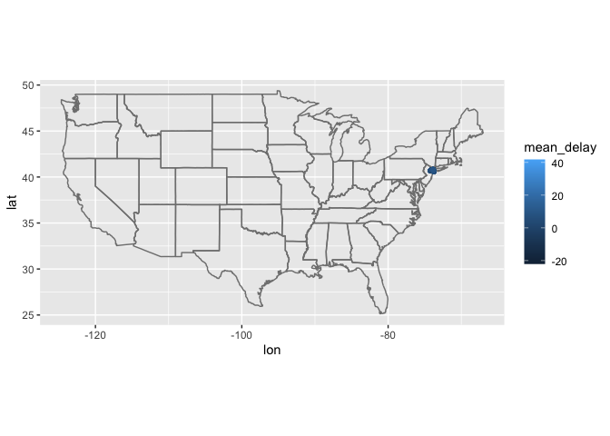

Question 2: Is there a relationship between the age of a plane and its
delays?

``` r
flights |> 
left_join(planes, join_by(tailnum), suffix=c("_flight","_manufactured")) |> 
  group_by(year_manufactured) |> 
  mutate(mean_delay=mean(arr_delay, na.rm=T)) |> 
  ggplot() + geom_line(mapping=aes(x=year_manufactured,y=mean_delay))
```

    Warning: Removed 57912 rows containing missing values or values outside the scale range
    (`geom_line()`).

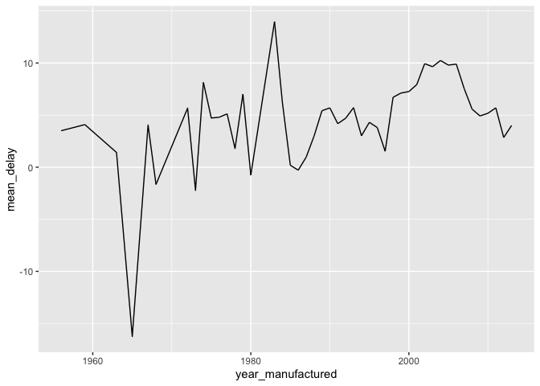

Answer:Not a very consistent relationship

Question 3: What weather conditions make it more likely to see a delay?

``` r
flights |> 
left_join(weather) |> 
group_by(wind_speed) |> 
mutate(mean_delay=mean(arr_delay, na.rm=T)) |> 
ggplot() + geom_line(mapping=aes(x=wind_speed,y=mean_delay))
```

    Joining with `by = join_by(year, month, day, origin, hour, time_hour)`

    Warning: Removed 1634 rows containing missing values or values outside the scale range
    (`geom_line()`).

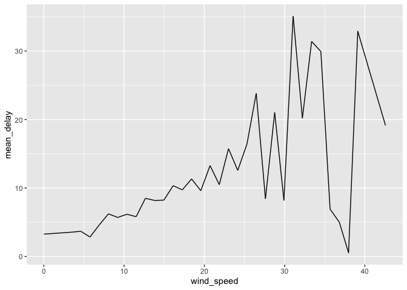

Answer:Generally higher wind speed creates a higher chance of a delay

``` r
# Load required packages
library(babynames) # install.packages("babynames")

babynames |> head() |> kable()
```

| year | sex | name      |    n |      prop |
|-----:|:----|:----------|-----:|----------:|
| 1880 | F   | Mary      | 7065 | 0.0723836 |
| 1880 | F   | Anna      | 2604 | 0.0266790 |
| 1880 | F   | Emma      | 2003 | 0.0205215 |
| 1880 | F   | Elizabeth | 1939 | 0.0198658 |
| 1880 | F   | Minnie    | 1746 | 0.0178884 |
| 1880 | F   | Margaret  | 1578 | 0.0161672 |

Question 1: What are the 6 most popular boy names and girl names of all
time? How has the popularity of each of these names changed over time?
This time, use the slice_max() function in combination with a join
function to answer this question.

``` r
babynames |> 
filter (sex=="M")|>
group_by(name) |> 
summarize(prop=sum(prop)) |> 
arrange(-prop) |> 
head(6) |> 
kable()
```

| name    |     prop |
|:--------|---------:|
| John    | 5.347063 |
| James   | 4.636984 |
| William | 4.482651 |
| Robert  | 3.850849 |
| Charles | 2.549545 |
| Michael | 2.434832 |

``` r
babynames |> 
filter(name=="John") |> 
ggplot() + geom_line(mapping=aes(x=year,y=prop))
```

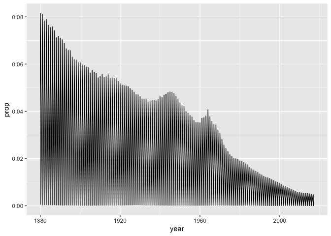

``` r
babynames |> 
filter(name=="James") |> 
ggplot() + geom_line(mapping=aes(x=year,y=prop))
```

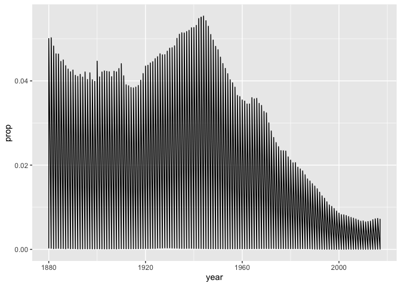

``` r
babynames |> 
filter(name=="William") |> 
ggplot() + geom_line(mapping=aes(x=year,y=prop))
```

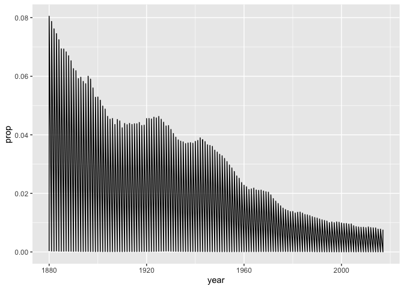

``` r
babynames |> 
filter(name=="Charles") |> 
ggplot() + geom_line(mapping=aes(x=year,y=prop))
```

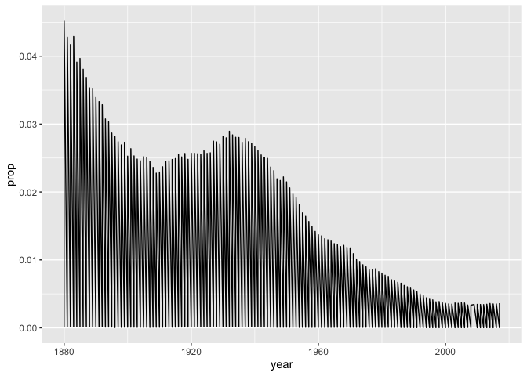

``` r
babynames |> 
filter(name=="Michael") |> 
ggplot() + geom_line(mapping=aes(x=year,y=prop))
```

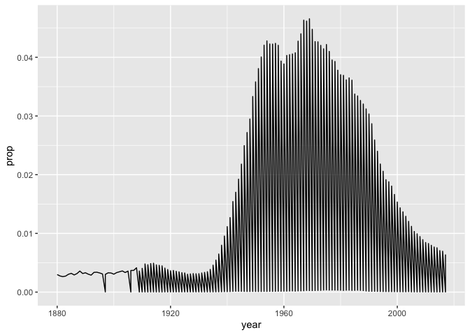

``` r
babynames |> 
filter (sex=="F")|>
group_by(name) |> 
summarize(prop=sum(prop)) |> 
arrange(-prop) |> 
head(6) |> 
kable()
```

| name      |     prop |
|:----------|---------:|
| Mary      | 4.524432 |
| Elizabeth | 1.437648 |
| Margaret  | 1.369804 |
| Helen     | 1.237829 |
| Anna      | 1.221712 |
| Dorothy   | 1.067039 |

``` r
babynames |> 
filter(name=="Mary") |> 
ggplot() + geom_line(mapping=aes(x=year,y=prop))
```

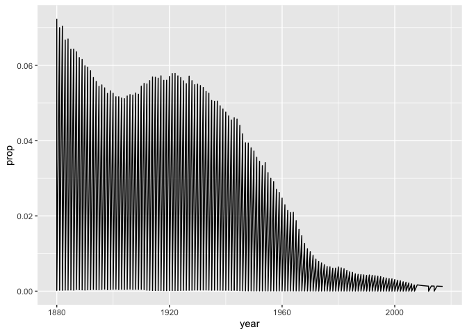

``` r
babynames |> 
filter(name=="Elizabeth") |> 
ggplot() + geom_line(mapping=aes(x=year,y=prop))
```

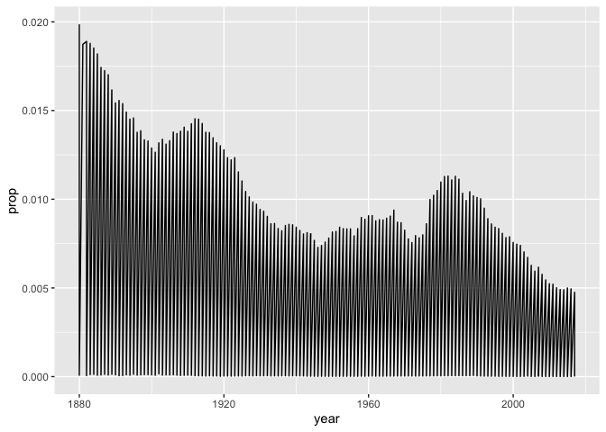

``` r
babynames |> 
filter(name=="Margaret") |> 
ggplot() + geom_line(mapping=aes(x=year,y=prop))
```

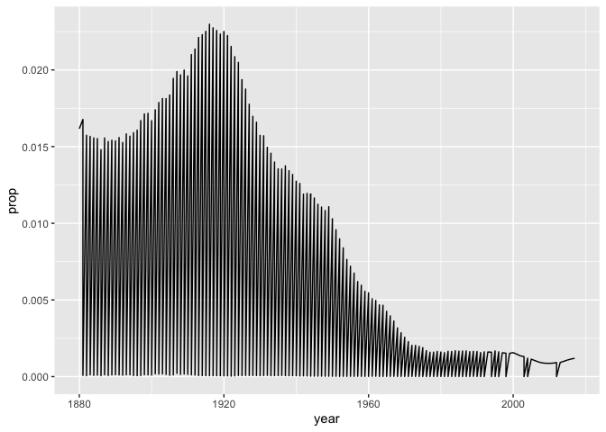

``` r
babynames |> 
filter(name=="Helen") |> 
ggplot() + geom_line(mapping=aes(x=year,y=prop))
```

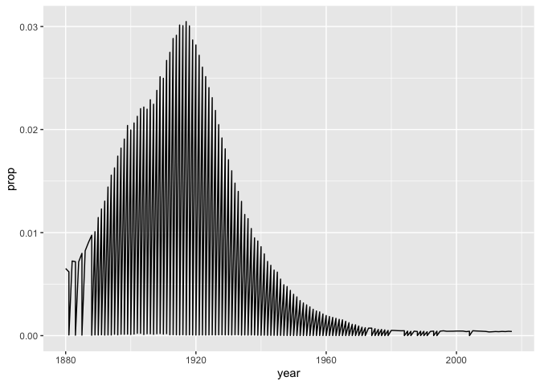

``` r
babynames |> 
filter(name=="Anna") |> 
ggplot() + geom_line(mapping=aes(x=year,y=prop))
```

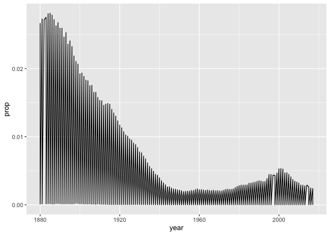

``` r
babynames |> 
filter(name=="Dorothy") |> 
ggplot() + geom_line(mapping=aes(x=year,y=prop))
```

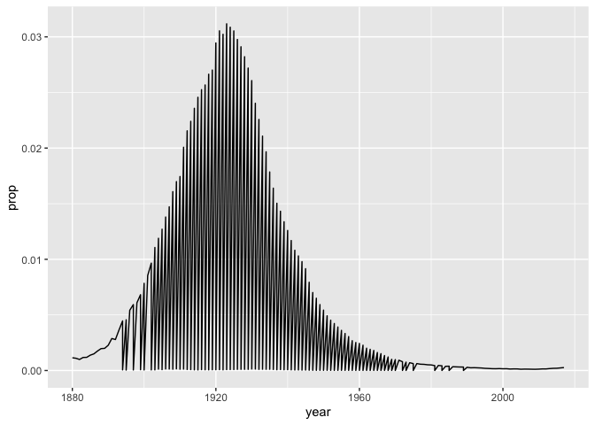
