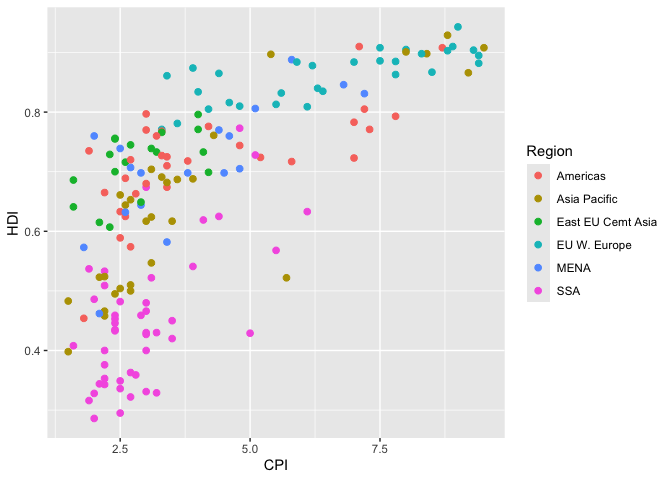
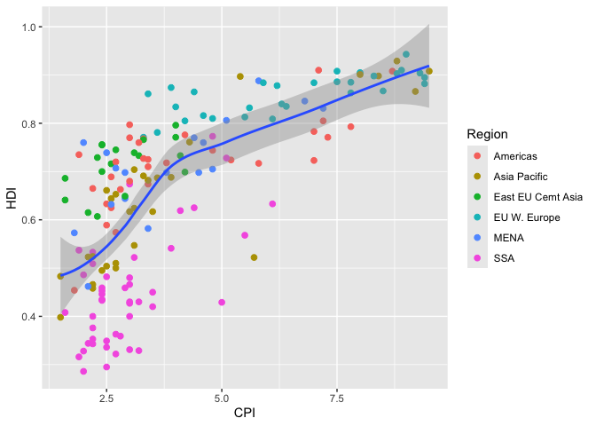
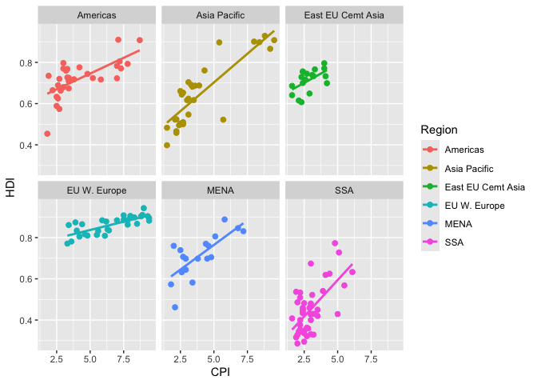

# Assignment 4

## Load packages

To start, load all the required packages with the following code.
Install them if they are not installed yet.

## Exercise 1. Corruption and human development

This exercise explores a dataset containing the human development index
`(HDI)` and corruption perception index `(CPI)` of 173 countries across
6 different regions around the world: Americas, Asia Pacific, Eastern
Europe and Central Asia `(East EU Cemt)`, Western Europe
`(EU W. Europe)`, Middle East and North Africa and Noth Africa `(MENA)`,
and Sub-Saharan Africa `(SSA)`. (Note: the larger `CPI` is, the less
corrupted the country is perceived to be.)

<br>

First, we load the data using the following code.

``` r
economist_data <- read.csv("https://raw.githubusercontent.com/nt246/NTRES-6100-data-science/master/datasets/EconomistData.csv")
```

<br>

**1.1 Show the first few rows of `economist_data.`**

      X     Country HDI.Rank   HDI CPI            Region
    1 1 Afghanistan      172 0.398 1.5      Asia Pacific
    2 2     Albania       70 0.739 3.1 East EU Cemt Asia
    3 3     Algeria       96 0.698 2.9              MENA
    4 4      Angola      148 0.486 2.0               SSA
    5 5   Argentina       45 0.797 3.0          Americas
    6 6     Armenia       86 0.716 2.6 East EU Cemt Asia

<br>

**1.2 Expore the relationship between human development index `(HDI)`
and corruption perception index `(CPI)` with a scatter plot as the
following.**


<br>

**1.3 Make the color of all points in the previous plot red.**


<br>

**1.4 Color the points in the previous plot according to the `Region`
variable, and set the size of points to 2.**



<br>

**1.5 Set the size of the points proportional to `HDI.Rank`**


<br>

**1.6 Fit a smoothing line to all the data points in the scatter plot
from Excercise 1.4**

    `geom_smooth()` using method = 'loess' and formula = 'y ~ x'



<br>

**1.7 Fit a separate straight line for each region instead, and turn off
the confidence interval.**

    `geom_smooth()` using formula = 'y ~ x'


<br>

**1.8 Building on top of the previous plot, show each `Region` in a
different facet.**

    `geom_smooth()` using formula = 'y ~ x'



<br>

**1.9 Show the distribution of `HDI` in each region using density plot.
Set the transparency to 0.5**


<br>

**1.10 Show the distribution of `HDI` in each region using histogram and
facetting.**

    `stat_bin()` using `bins = 30`. Pick better value with `binwidth`.


<br>

**1.11 Show the distribution of `HDI` in each region using a box plot.
Set the transparency of these boxes to 0.5 and do not show outlier
points with the box plot. Instead, show all data points for each country
in the same plot. (Hint: geom_jitter() or position_jitter() might be
useful.)**


<br>

**1.12 Show the count of countries in each region using a bar plot.**

    Warning in geom_bar(mapping = aes(x = Region, Fill = Region)): Ignoring unknown
    aesthetics: Fill


<br>

**1.13 You have now created a variety of different plots of the same
dataset. Which of your plots do you think are the most informative?
Describe briefly the major trends that you see in the data.**

Answer:

In general CPI increases as HDI increases and in my opinion the graph
that showed that best was the graph from 1.6.

## Exercise 2. Theophylline experiment

This exercise uses the `Theoph` data frame (comes with your R
installation), which has 132 rows and 5 columns of data from an
experiment on the pharmacokinetics of the anti-asthmatic drug
theophylline. Twelve subjects were given oral doses of theophylline then
serum concentrations were measured at 11 time points over the next 25
hours. You can learn more about this dataset by running `?Theoph`

Have a look at the data structure

| Subject |   Wt | Dose | Time |  conc |
|:--------|-----:|-----:|-----:|------:|
| 1       | 79.6 | 4.02 | 0.00 |  0.74 |
| 1       | 79.6 | 4.02 | 0.25 |  2.84 |
| 1       | 79.6 | 4.02 | 0.57 |  6.57 |
| 1       | 79.6 | 4.02 | 1.12 | 10.50 |
| 1       | 79.6 | 4.02 | 2.02 |  9.66 |
| 1       | 79.6 | 4.02 | 3.82 |  8.58 |

For the following exercise, **transform the data as instructed.** Try to
use tidyverse functions even if you are more comfortable with base-R
solutions. Show the **first 6 lines** of the transformed data in a table
through RMarkdown using the **kable() function**, as shown above.

<br>

**2.1 Select columns that contain a lower case “t” in the `Theoph`
dataset. Do not manually list all the columns to include.**

| Subject |   Wt | Time |
|:--------|-----:|-----:|
| 1       | 79.6 | 0.00 |
| 1       | 79.6 | 0.25 |
| 1       | 79.6 | 0.57 |
| 1       | 79.6 | 1.12 |
| 1       | 79.6 | 2.02 |
| 1       | 79.6 | 3.82 |

<br>

**2.2 Rename the `Wt` column to `Weight` and `conc` column to
`Concentration` in the `Theoph` dataset.**

| Subject | Weight | Dose | Time | Concentrtation |
|:--------|-------:|-----:|-----:|---------------:|
| 1       |   79.6 | 4.02 | 0.00 |           0.74 |
| 1       |   79.6 | 4.02 | 0.25 |           2.84 |
| 1       |   79.6 | 4.02 | 0.57 |           6.57 |
| 1       |   79.6 | 4.02 | 1.12 |          10.50 |
| 1       |   79.6 | 4.02 | 2.02 |           9.66 |
| 1       |   79.6 | 4.02 | 3.82 |           8.58 |

<br>

**2.3 Extract the `Dose` greater than 4.5 and `Time` greater than the
mean `Time.`**

| Subject |   Wt | Dose |  Time | conc |
|:--------|-----:|-----:|------:|-----:|
| 3       | 70.5 | 4.53 |  7.07 | 5.30 |
| 3       | 70.5 | 4.53 |  9.00 | 4.90 |
| 3       | 70.5 | 4.53 | 12.15 | 3.70 |
| 3       | 70.5 | 4.53 | 24.17 | 1.05 |
| 5       | 54.6 | 5.86 |  7.02 | 7.09 |
| 5       | 54.6 | 5.86 |  9.10 | 5.90 |

<br>

**2.4 Sort the Theoph dataset by `Wt` from smallest to largest and
secondarily by `Time` from largest to smallest.**

| Subject |   Wt | Dose | Time |  conc |
|:--------|-----:|-----:|-----:|------:|
| 5       | 54.6 | 5.86 | 0.00 |  0.00 |
| 5       | 54.6 | 5.86 | 0.30 |  2.02 |
| 5       | 54.6 | 5.86 | 0.52 |  5.63 |
| 5       | 54.6 | 5.86 | 1.00 | 11.40 |
| 5       | 54.6 | 5.86 | 2.02 |  9.33 |
| 5       | 54.6 | 5.86 | 3.50 |  8.74 |

<br>

**2.5 Create a new column called `Quantity` that equals to \`Wt x Dose
in the Theoph dataset. This will tell you the absolute quantity of drug
administered to the subject (in mg). Replace the Dose variable with
Quantity.**

| Subject |   Wt | Time |  conc | Quantity |
|:--------|-----:|-----:|------:|---------:|
| 1       | 79.6 | 0.00 |  0.74 |   319.99 |
| 1       | 79.6 | 0.25 |  2.84 |   319.99 |
| 1       | 79.6 | 0.57 |  6.57 |   319.99 |
| 1       | 79.6 | 1.12 | 10.50 |   319.99 |
| 1       | 79.6 | 2.02 |  9.66 |   319.99 |
| 1       | 79.6 | 3.82 |  8.58 |   319.99 |

**2.6 Find the mean `conc` and sum of the `Dose` received by each test
subject.**

Show data for the 6 subjects with the smallest sum of `Dose` as below.
**Do not define new intermediate objects for this exercise; use pipes to
chain together functions**

| Subject | mean_conc | total_dose |
|:--------|----------:|-----------:|
| 6       |  3.525454 |      44.00 |
| 7       |  3.910909 |      54.45 |
| 8       |  4.271818 |      49.83 |
| 11      |  4.510909 |      54.12 |
| 3       |  5.086364 |      49.83 |
| 2       |  4.823636 |      48.40 |
