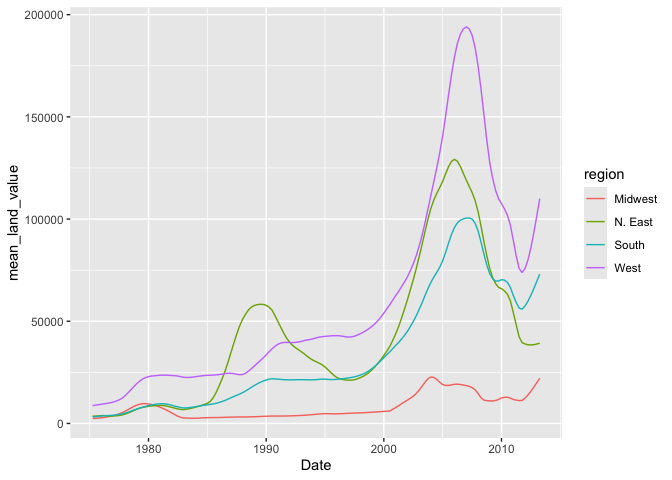
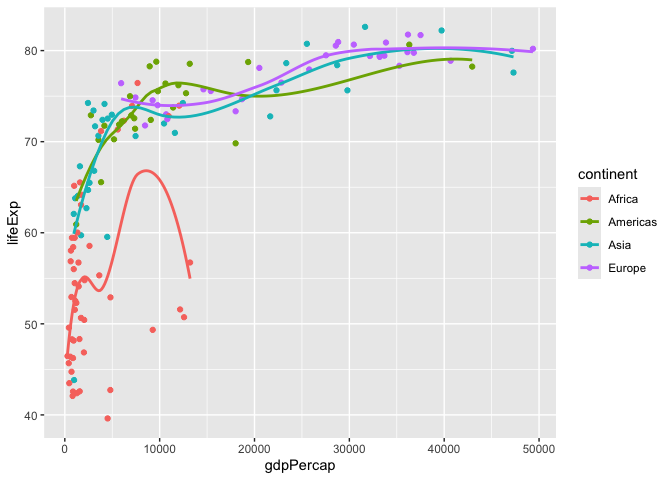
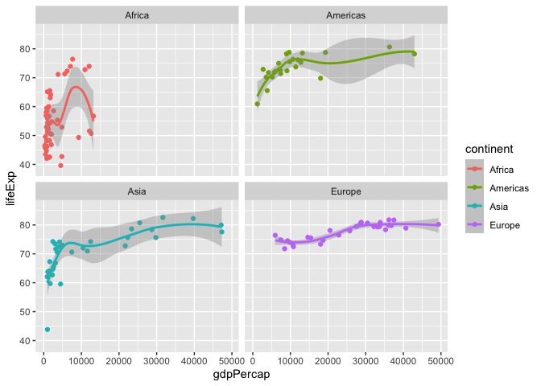
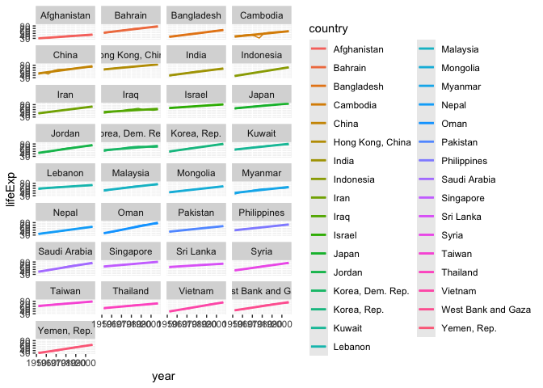

# Assignment 5

## **Exercise 1. Trends in land value**

This excercise uses a dataset that describes the trends in land value
(`Land.Value`), among other variables, in different states in the US
1975-2013. The states are grouped into four different regions, under the
variable `region`. This dataset was obtained from the Data Science
Services of Harvard University.

**1.1 Washington DC was not assigned to a region in this dataset.
According to the United States Census Bureau, however, DC is part of the
South region. Here:**

- Change the region of DC to “South” (Hint: there are multiple ways to
  do this, but mutate() and ifelse() might be helpful)

- Create a new tibble or regular dataframe consisting of this new
  updated region variable along with the original variables State, Date
  and Land.Value (and no others)

- Pull out the records from DC in this new data frame. How many records
  are there from DC? Show the first 6 lines.

``` r
housing2 <- housing |> 
mutate(region=ifelse(State=="DC","South",region)) 

housing2 |> 
select(region,State,Land.Value,Date) |>
filter(State=="DC") |> 
head(6) |> 
kable()
```

| region | State | Land.Value |    Date |
|:-------|:------|-----------:|--------:|
| South  | DC    |     290522 | 2003.00 |
| South  | DC    |     305673 | 2003.25 |
| South  | DC    |     323078 | 2003.50 |
| South  | DC    |     342010 | 2003.75 |
| South  | DC    |     361999 | 2004.00 |
| South  | DC    |     382792 | 2004.25 |

Answer=There are 153 values

**1.2 Generate a tibble/dataframe that summarizes the mean land value of
each region at each time point and show its first 6 lines.**

``` r
housing2 |> 
group_by(region,Date) |> 
summarize(mean_land_value=(mean(Land.Value))) |> head(6) |> 
kable()
```

    `summarise()` has grouped output by 'region'. You can override using the
    `.groups` argument.

| region  |    Date | mean_land_value |
|:--------|--------:|----------------:|
| Midwest | 1975.25 |        2452.167 |
| Midwest | 1975.50 |        2498.917 |
| Midwest | 1975.75 |        2608.167 |
| Midwest | 1976.00 |        2780.000 |
| Midwest | 1976.25 |        2967.333 |
| Midwest | 1976.50 |        3212.833 |

**1.3 Using the tibble/dataframe from 1.2, plot the trend in mean land
value of each region through time.**

``` r
housing2 |> 
group_by(region,Date) |> 
summarize(mean_land_value=(mean(Land.Value))) |>
ggplot()+
geom_line(mapping = aes(x=Date,y=mean_land_value,color=region)) 
```

    `summarise()` has grouped output by 'region'. You can override using the
    `.groups` argument.



## **Exercise 2. Life expectancy and GDP per capita 1952-2007**

This exercise uses the `gapminder` dataset from the `gapminder` package.
It describes the life expectancy `(lifeExp)`, GDP per capita
`(gdpPercap)`, and population `(pop)` of 142 countries from 1952 to
2007. These countries can be grouped into 5 continents. **As a reminder,
reproduce the following plots exactly as shown.**

``` r
gapminder %>% 
  head() %>% 
  kable()
```

| country     | continent | year | lifeExp |      pop | gdpPercap |
|:------------|:----------|-----:|--------:|---------:|----------:|
| Afghanistan | Asia      | 1952 |  28.801 |  8425333 |  779.4453 |
| Afghanistan | Asia      | 1957 |  30.332 |  9240934 |  820.8530 |
| Afghanistan | Asia      | 1962 |  31.997 | 10267083 |  853.1007 |
| Afghanistan | Asia      | 1967 |  34.020 | 11537966 |  836.1971 |
| Afghanistan | Asia      | 1972 |  36.088 | 13079460 |  739.9811 |
| Afghanistan | Asia      | 1977 |  38.438 | 14880372 |  786.1134 |

**2.1 Use a scatterplot to explore the relationship between per capita
GDP (gdpPercap) and life expectancy (lifeExp) in the year 2007.**

``` r
gapminder |> 
filter(year=="2007") |> 
ggplot(aes(x=gdpPercap, y=lifeExp)) + geom_point()
```


**2.2 Add a smoothing line to the previous plot.**

``` r
gapminder |> 
filter(year=="2007") |> 
ggplot(aes(x=gdpPercap, y=lifeExp)) + geom_point() + geom_smooth()
```

    `geom_smooth()` using method = 'loess' and formula = 'y ~ x'


**2.3 Exclude Oceania from the previous plot, show each continent in a
different color, and fit a separate smoothing line to each continent to
identify differences in this relationship between continents. Turn off
the confidence intervals.** Note: only two Oceanian countries are
included in this dataset, and `geom_smooth()` does not work with two
data points, which is why they are excluded.

``` r
gapminder |> 
filter(year=="2007",continent != "Oceania") |> 
ggplot(aes(x=gdpPercap, y=lifeExp,color=continent)) + geom_point() + geom_smooth(se=FALSE)
```

    `geom_smooth()` using method = 'loess' and formula = 'y ~ x'



**2.4 Use faceting to solve the same problem. Include the confidence
intervals in this plot.**

``` r
gapminder |> 
filter(year=="2007",continent != "Oceania") |> 
ggplot(aes(x=gdpPercap, y=lifeExp,color=continent)) + geom_point() + geom_smooth()+facet_wrap(~continent,nrow = 2)
```

    `geom_smooth()` using method = 'loess' and formula = 'y ~ x'



**2.5 Explore the trend in life expectancy through time in each
continent. Color by continent.**

``` r
gapminder |> 
group_by(continent) |> 
ggplot(aes(x=year, y=lifeExp,color=continent)) + geom_line() + geom_smooth(method = "lm", se = FALSE) + facet_wrap(~continent,nrow = 2)
```

    `geom_smooth()` using formula = 'y ~ x'


**2.6 From the previous plot, we see some abnormal trends in Asia and
Africa, where the the life expectancy in some countries sharply dropped
at certain time periods. Here, we look into what happened in Asia in
more detail. First, create a new dataset by filtering only the Asian
countries. Show the first 6 lines of this filtered dataset.**

``` r
gapminder |> 
filter(continent=="Asia") |> 
head(6) |> 
kable()
```

| country     | continent | year | lifeExp |      pop | gdpPercap |
|:------------|:----------|-----:|--------:|---------:|----------:|
| Afghanistan | Asia      | 1952 |  28.801 |  8425333 |  779.4453 |
| Afghanistan | Asia      | 1957 |  30.332 |  9240934 |  820.8530 |
| Afghanistan | Asia      | 1962 |  31.997 | 10267083 |  853.1007 |
| Afghanistan | Asia      | 1967 |  34.020 | 11537966 |  836.1971 |
| Afghanistan | Asia      | 1972 |  36.088 | 13079460 |  739.9811 |
| Afghanistan | Asia      | 1977 |  38.438 | 14880372 |  786.1134 |

**2.7 Using the filtered dataset, identify the countries that had
abnormal trends in life expectancy by plotting, and discuss historical
events possibly explaining these trends. (Hint: facet by country)**

``` r
gapminder |> 
filter(continent =="Asia") |>
group_by(country) |> 
ggplot(aes(x=year, y=lifeExp,color=country)) + geom_line() + geom_smooth(method = "lm", se = FALSE) + facet_wrap(~country,nrow = 10)
```

    `geom_smooth()` using formula = 'y ~ x'



Answer: Vietnam has a particularly sharp increase in life expectancy
over time, which could likely be explained by the end of the Vietnam
war. Afghanistan’s line barely increases at all which is likely due to
continuing violence in that part of the world.
