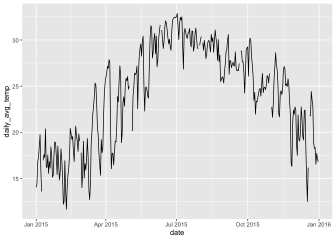
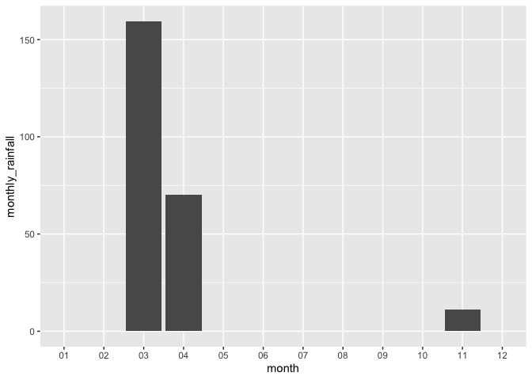
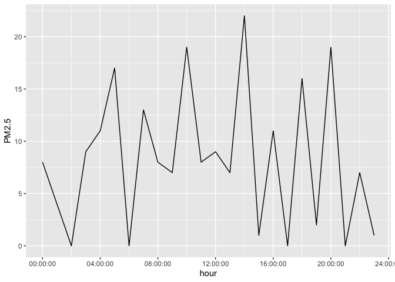

# assignment6

``` r
library(tidyverse)
```

    Warning: package 'ggplot2' was built under R version 4.3.3

    ── Attaching core tidyverse packages ──────────────────────── tidyverse 2.0.0 ──
    ✔ dplyr     1.1.2     ✔ readr     2.1.4
    ✔ forcats   1.0.0     ✔ stringr   1.5.0
    ✔ ggplot2   3.5.2     ✔ tibble    3.2.1
    ✔ lubridate 1.9.2     ✔ tidyr     1.3.0
    ✔ purrr     1.0.1     
    ── Conflicts ────────────────────────────────────────── tidyverse_conflicts() ──
    ✖ dplyr::filter() masks stats::filter()
    ✖ dplyr::lag()    masks stats::lag()
    ℹ Use the conflicted package (<http://conflicted.r-lib.org/>) to force all conflicts to become errors

``` r
library(dplyr)
library(tidyr)
library(readr)
library(knitr)
```

    Warning: package 'knitr' was built under R version 4.3.3

**1.1 Create the following tibble manually, first using `tribble()` and
then using `tibble().` Print both results. \[We didn’t have time to
cover this in class, but look up how these functions work here**

``` r
tibble (a=1:2,
          b=2.1:3.2,
          c="apple","orange")
```

    # A tibble: 2 × 4
          a     b c     `"orange"`
      <int> <dbl> <chr> <chr>     
    1     1   2.1 apple orange    
    2     2   3.1 apple orange    

``` r
tribble(
 ~a, ~b, ~c,
 
 #--|--|----
 1, 2.1, "apple",
 2, 3.2, "orange")
```

    # A tibble: 2 × 3
          a     b c     
      <dbl> <dbl> <chr> 
    1     1   2.1 apple 
    2     2   3.2 orange

**1.3 Import
https://raw.githubusercontent.com/nt246/NTRES-6100-data-science/master/datasets/dataset3.txt
into R. Watch out for the first few lines, missing values, separators,
quotation marks, and deliminaters.**

``` r
fruit <- read_delim("https://raw.githubusercontent.com/nt246/NTRES-6100-data-science/master/datasets/dataset3.txt",skip=2, delim=";", quote ="/", na=c("?","Not Available"))
```

    Rows: 3 Columns: 3
    ── Column specification ────────────────────────────────────────────────────────
    Delimiter: ";"
    chr (1): Name
    dbl (2): Weight, Price

    ℹ Use `spec()` to retrieve the full column specification for this data.
    ℹ Specify the column types or set `show_col_types = FALSE` to quiet this message.

``` r
fruit
```

    # A tibble: 3 × 3
      Name   Weight Price
      <chr>   <dbl> <dbl>
    1 apple       1   2.9
    2 orange      2  NA  
    3 durian     NA  19.9

**1.5 Import
https://raw.githubusercontent.com/nt246/NTRES-6100-data-science/master/datasets/dataset5.txt
into R. Parse the columns properly. As a reminder, you can read about
parsing date and time data here. Write this imported and parsed data
frame into a new csv file named dataset5_new.csv in your problem_sets
folder.**

``` r
fruit2 <- read_delim("https://raw.githubusercontent.com/nt246/NTRES-6100-data-science/master/datasets/dataset5.txt", delim=" ")
```

    Rows: 3 Columns: 3
    ── Column specification ────────────────────────────────────────────────────────
    Delimiter: " "
    chr  (2): Name, Expiration Date
    time (1): Time

    ℹ Use `spec()` to retrieve the full column specification for this data.
    ℹ Specify the column types or set `show_col_types = FALSE` to quiet this message.

``` r
fruit_clean <- fruit2 |> mutate(Expiration_date=parse_date(`Expiration Date`, format="%B %d, %Y"))

write_csv(fruit_clean,file="fruit.csv")
```

***Exercise 2. Weather station***

\*\*2.1 Variable descriptions The text file
https://raw.githubusercontent.com/nt246/NTRES-6100-data-science/master/datasets/2015y_Weather_Station_notes.txt
contains descriptions of different variables collected by the station.

Import it into R and print it in a table as shown below with
kable().\*\*

``` r
weather <- read_delim("https://raw.githubusercontent.com/nt246/NTRES-6100-data-science/master/datasets/2015y_Weather_Station_notes.txt", delim="-") 
```

    Rows: 15 Columns: 3
    ── Column specification ────────────────────────────────────────────────────────
    Delimiter: "-"
    chr (3): Item, Unit, Description

    ℹ Use `spec()` to retrieve the full column specification for this data.
    ℹ Specify the column types or set `show_col_types = FALSE` to quiet this message.

``` r
weather |> kable()
```

| Item       | Unit    | Description                                               |
|:-----------|:--------|:----------------------------------------------------------|
| AMB_TEMP   | Celsius | Ambient air temperature                                   |
| CO         | ppm     | Carbon monoxide                                           |
| NO         | ppb     | Nitric oxide                                              |
| NO2        | ppb     | Nitrogen dioxide                                          |
| NOx        | ppb     | Nitrogen oxides                                           |
| O3         | ppb     | Ozone                                                     |
| PM10       | μg/m3   | Particulate matter with a diameter between 2.5 and 10 μm  |
| PM2.5      | μg/m3   | Particulate matter with a diameter of 2.5 μm or less      |
| RAINFALL   | mm      | Rainfall                                                  |
| RH         | %       | Relative humidity                                         |
| SO2        | ppb     | Sulfur dioxide                                            |
| WD_HR      | degress | Wind direction (The average of hour)                      |
| WIND_DIREC | degress | Wind direction (The average of last ten minutes per hour) |
| WIND_SPEED | m/sec   | Wind speed (The average of last ten minutes per hour)     |
| WS_HR      | m/sec   | Wind speed (The average of hour)                          |

#### **2.2 Data tidying**

- Import
  `https://raw.githubusercontent.com/nt246/NTRES-6100-data-science/master/datasets/2015y_Weather_Station.csv`
  into R. As you can see, this dataset is a classic example of untidy
  data: values of a variable (i.e. hour of the day) are stored as column
  names; variable names are stored in the `item` column.

- Clean this dataset up and restructure it into a tidy format.

- Parse the `date` variable into date format and parse `hour` into time.

- Turn all invalid values into `NA` and turn `NR` in rainfall into `0`.

- Parse all values into numbers.

- Show the first 6 rows and 10 columns of this cleaned dataset, as shown
  below, *without* using `kable()`.

*Hints: you don’t have to perform these tasks in the given order; also,
warning messages are not necessarily signs of trouble.*

Before cleaning:

``` r
weather2 <- read_csv("https://raw.githubusercontent.com/nt246/NTRES-6100-data-science/master/datasets/2015y_Weather_Station.csv", col_types = cols(.default="c")) 

head(weather2) 
```

    # A tibble: 6 × 27
      date       station item  `00`  `01`  `02`  `03`  `04`  `05`  `06`  `07`  `08` 
      <chr>      <chr>   <chr> <chr> <chr> <chr> <chr> <chr> <chr> <chr> <chr> <chr>
    1 2015/01/01 Cailiao AMB_… 16    16    15    15    15    14    14    14    14   
    2 2015/01/01 Cailiao CO    0.74  0.7   0.66  0.61  0.51  0.51  0.51  0.6   0.62 
    3 2015/01/01 Cailiao NO    1     0.8   1.1   1.7   2     1.7   1.9   2.4   3.4  
    4 2015/01/01 Cailiao NO2   15    13    13    12    11    13    13    16    16   
    5 2015/01/01 Cailiao NOx   16    14    14    13    13    15    15    18    19   
    6 2015/01/01 Cailiao O3    35    36    35    34    34    32    30    26    26   
    # ℹ 15 more variables: `09` <chr>, `10` <chr>, `11` <chr>, `12` <chr>,
    #   `13` <chr>, `14` <chr>, `15` <chr>, `16` <chr>, `17` <chr>, `18` <chr>,
    #   `19` <chr>, `20` <chr>, `21` <chr>, `22` <chr>, `23` <chr>

Cleaning Process

``` r
weather2_clean <-weather2 |> pivot_longer(c("00","01","02","03","04","05","06","07","08","09",
"10","11","12","13","14","15","16","17","18","19","20","21","22","23"),
names_to="hour")|> 
pivot_wider(values_from = value, names_from = item) |> mutate(RAINFALL=ifelse(RAINFALL=="NR","0",RAINFALL)) |> 
mutate(date=parse_date(date,format = "%Y/%m/%d")) |> 
mutate(hour=parse_time(hour,format="%h")) |> 
mutate(AMB_TEMP=parse_number(AMB_TEMP)) |> 
mutate(RAINFALL=parse_number(RAINFALL)) |> 
mutate(CO=parse_number(CO)) |> 
mutate(NO=parse_number(NO)) |> 
mutate(NO2=parse_number(NO2)) |> 
mutate(NOx=parse_number(NOx)) |> 
mutate(O3=parse_number(O3)) |> 
mutate(PM10=parse_number(PM10)) |> 
mutate(PM2.5=parse_number(PM2.5)) |> 
mutate(RH=parse_number(RH)) |> 
mutate(SO2=parse_number(SO2)) |> 
mutate(WD_HR=parse_number(WD_HR)) |> 
mutate(WIND_DIREC=parse_number(WIND_DIREC)) |> 
mutate(WIND_SPEED=parse_number(WIND_SPEED)) |> 
mutate(WS_HR=parse_number(WS_HR))
```

After Cleaning

``` r
weather2_clean |> head(10)
```

    # A tibble: 10 × 18
       date       station hour   AMB_TEMP    CO    NO   NO2   NOx    O3  PM10 PM2.5
       <date>     <chr>   <time>    <dbl> <dbl> <dbl> <dbl> <dbl> <dbl> <dbl> <dbl>
     1 2015-01-01 Cailiao 00:00        16  0.74   1      15    16    35   171    76
     2 2015-01-01 Cailiao 01:00        16  0.7    0.8    13    14    36   174    78
     3 2015-01-01 Cailiao 02:00        15  0.66   1.1    13    14    35   160    69
     4 2015-01-01 Cailiao 03:00        15  0.61   1.7    12    13    34   142    60
     5 2015-01-01 Cailiao 04:00        15  0.51   2      11    13    34   123    52
     6 2015-01-01 Cailiao 05:00        14  0.51   1.7    13    15    32   110    44
     7 2015-01-01 Cailiao 06:00        14  0.51   1.9    13    15    30   104    40
     8 2015-01-01 Cailiao 07:00        14  0.6    2.4    16    18    26   104    41
     9 2015-01-01 Cailiao 08:00        14  0.62   3.4    16    19    26   109    44
    10 2015-01-01 Cailiao 09:00        15  0.58   3.7    14    18    29   105    44
    # ℹ 7 more variables: RAINFALL <dbl>, RH <dbl>, SO2 <dbl>, WD_HR <dbl>,
    #   WIND_DIREC <dbl>, WIND_SPEED <dbl>, WS_HR <dbl>

**2.3 Using this cleaned dataset, plot the daily variation in ambient
temperature on September 25, 2015, as shown below.**

``` r
weather2_clean |> 
  filter(date=="2015/09/25") |> 
  ggplot() + geom_line(mapping = aes(x=hour,y=AMB_TEMP)) 
```


**2.4 Plot the daily average ambient temperature throughout the year
with a continuous line, as shown below.**

``` r
weather2_clean |> 
group_by(date) |> 
summarize(daily_avg_temp=mean(AMB_TEMP)) |> 
ggplot() + geom_line(mapping=aes(x=date, y=daily_avg_temp))
```



**2.5 Plot the total rainfall per month in a bar chart, as shown below.
Hint: separating date into three columns might be helpful.**

``` r
weather_split <- weather2_clean |> 
separate(date,into = c("year","month","day"),sep = "-") 


weather_split |> 
group_by(month) |> 
summarize(monthly_rainfall=sum(RAINFALL)) |> 
replace_na(list(x="0")) |> 
ggplot() + geom_col(mapping=aes(x=month,y=monthly_rainfall))
```

    Warning: Removed 9 rows containing missing values or values outside the scale range
    (`geom_col()`).



**2.6 Plot the per hour variation in PM2.5 in the first week of
September with a continuous line, as shown below. Hint: uniting the date
and hour and parsing the new variable might be helpful.**

``` r
unite(weather_split, year, month, day, sep=" ") |> 
  filter(year==c("09 01","09 02","09 03","09 04","09 05","09 06","09 07","09 08")) |>
  group_by(hour)|> 
  ggplot(aes(x=hour, y=PM2.5)) + 
  geom_line()
```


