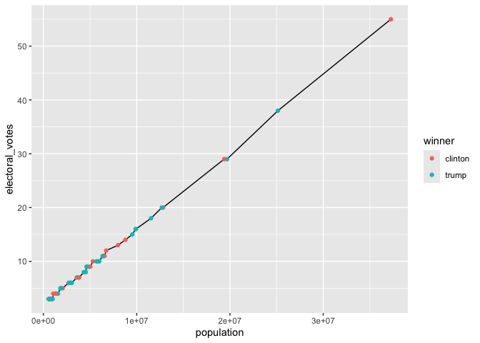
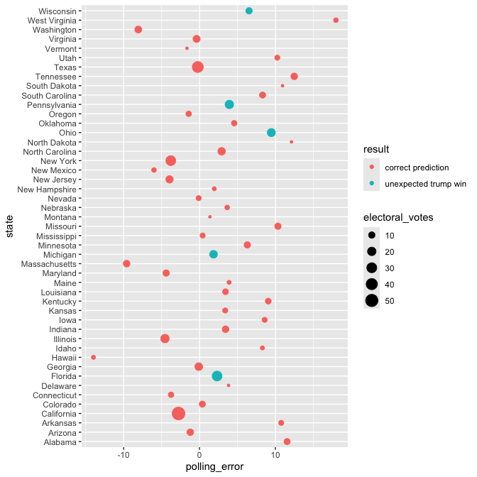

# assignment7

``` r
library(tidyverse)
```

    Warning: package 'ggplot2' was built under R version 4.3.3

    ── Attaching core tidyverse packages ──────────────────────── tidyverse 2.0.0 ──
    ✔ dplyr     1.1.2     ✔ readr     2.1.4
    ✔ forcats   1.0.0     ✔ stringr   1.5.0
    ✔ ggplot2   3.5.2     ✔ tibble    3.2.1
    ✔ lubridate 1.9.2     ✔ tidyr     1.3.0
    ✔ purrr     1.0.1     
    ── Conflicts ────────────────────────────────────────── tidyverse_conflicts() ──
    ✖ dplyr::filter() masks stats::filter()
    ✖ dplyr::lag()    masks stats::lag()
    ℹ Use the conflicted package (<http://conflicted.r-lib.org/>) to force all conflicts to become errors

``` r
library(knitr)
```

    Warning: package 'knitr' was built under R version 4.3.3

``` r
library(dslabs)
```

## **Excercise: 2016 election result and polling**

For this exercise, we will explore the result of the 2016 US
presidential election as well as the polling data. We will use the
following three datasets in the `dslabs` package, and use `join`
function to connect them together. As a reminder, you can use `?` to
learn more about these datasets.

- `results_us_election_2016`: Election results (popular vote) and
  electoral college votes from the 2016 presidential election.

- `polls_us_election_2016`: Poll results from the 2016 presidential
  elections.

- `murders`: Gun murder data from FBI reports. It also contains the
  population of each state.

We will also use [this
dataset](https://raw.githubusercontent.com/kshaffer/election2016/master/2016ElectionResultsByState.csv)
to get the exact numbers of votes for question 3.

### **Question 1. What is the relationship between the population size and the number of electoral votes each state has?**

**1a.** Use a `join` function to combine the `murders` dataset, which
contains information on population size, and the
`results_us_election_2016` dataset, which contains information on the
number of electoral votes. Name this new dataset `q_1a`, and show its
first 6 rows.

``` r
q_1a <- left_join(murders,results_us_election_2016) 
```

    Joining with `by = join_by(state)`

``` r
q_1a |> head(6) |> kable()
```

| state      | abb | region | population | total | electoral_votes | clinton | trump | others |
|:-----------|:----|:-------|-----------:|------:|----------------:|--------:|------:|-------:|
| Alabama    | AL  | South  |    4779736 |   135 |               9 |    34.4 |  62.1 |    3.6 |
| Alaska     | AK  | West   |     710231 |    19 |               3 |    36.6 |  51.3 |   12.2 |
| Arizona    | AZ  | West   |    6392017 |   232 |              11 |    45.1 |  48.7 |    6.2 |
| Arkansas   | AR  | South  |    2915918 |    93 |               6 |    33.7 |  60.6 |    5.8 |
| California | CA  | West   |   37253956 |  1257 |              55 |    61.7 |  31.6 |    6.7 |
| Colorado   | CO  | West   |    5029196 |    65 |               9 |    48.2 |  43.3 |    8.6 |

**1b.** Add a new variable in the `q_1a` dataset to indicate which
candidate won in each state, and remove the columns `abb`, `region`, and
`total`. Name this new dataset `q_1b`, and show its first 6 rows.

``` r
q_1b <- q_1a |> 
select(-abb) |> 
mutate(winner=ifelse(clinton > trump, "clinton", "trump"))

q_1b |> head(6) |> kable()
```

| state      | region | population | total | electoral_votes | clinton | trump | others | winner  |
|:-----------|:-------|-----------:|------:|----------------:|--------:|------:|-------:|:--------|
| Alabama    | South  |    4779736 |   135 |               9 |    34.4 |  62.1 |    3.6 | trump   |
| Alaska     | West   |     710231 |    19 |               3 |    36.6 |  51.3 |   12.2 | trump   |
| Arizona    | West   |    6392017 |   232 |              11 |    45.1 |  48.7 |    6.2 | trump   |
| Arkansas   | South  |    2915918 |    93 |               6 |    33.7 |  60.6 |    5.8 | trump   |
| California | West   |   37253956 |  1257 |              55 |    61.7 |  31.6 |    6.7 | clinton |
| Colorado   | West   |    5029196 |    65 |               9 |    48.2 |  43.3 |    8.6 | clinton |

**1c.** Using the `q_1b` dataset, plot the relationship between
population size and number of electoral votes. Use color to indicate who
won the state. Fit a straight line to the data, set its color to black,
size to 0.1, and turn off its confidence interval.

``` r
q_1b |> ggplot(mapping=aes(x=population, y=electoral_votes)) + 
geom_line() + geom_point(mapping=aes(color=winner))
```



### **Question 2. Would the election result be any different if the number of electoral votes is exactly proportional to a state’s population size?**

**2a.** First, convert the `q_1b` dataset to longer format such that the
`population` and `electoral_votes` columns are turned into rows as shown
below. Name this new dataset `q_2a`, and show its first 6 rows.

``` r
q_2a <- q_1b |> 
pivot_longer(c(electoral_votes,population),names_to="metric",values_to="value") 

q_2a |> head(6) |> kable()
```

| state   | region | total | clinton | trump | others | winner | metric          |   value |
|:--------|:-------|------:|--------:|------:|-------:|:-------|:----------------|--------:|
| Alabama | South  |   135 |    34.4 |  62.1 |    3.6 | trump  | electoral_votes |       9 |
| Alabama | South  |   135 |    34.4 |  62.1 |    3.6 | trump  | population      | 4779736 |
| Alaska  | West   |    19 |    36.6 |  51.3 |   12.2 | trump  | electoral_votes |       3 |
| Alaska  | West   |    19 |    36.6 |  51.3 |   12.2 | trump  | population      |  710231 |
| Arizona | West   |   232 |    45.1 |  48.7 |    6.2 | trump  | electoral_votes |      11 |
| Arizona | West   |   232 |    45.1 |  48.7 |    6.2 | trump  | population      | 6392017 |

**2b.** Then, sum up the number of electoral votes and population size
across all states for each candidate. Name this new dataset `q_2b`, and
print it as shown below.

``` r
q_2b <- 
q_2a |> 
select(metric,winner,value) |> 
group_by(metric,winner) |> 
summarize(value=sum(value))
```

    `summarise()` has grouped output by 'metric'. You can override using the
    `.groups` argument.

``` r
kable(q_2b)
```

| metric          | winner  |     value |
|:----------------|:--------|----------:|
| electoral_votes | clinton |       233 |
| electoral_votes | trump   |       305 |
| population      | clinton | 134982448 |
| population      | trump   | 174881780 |

**2c. Use the q_2b dataset to contruct a bar plot to show the final
electoral vote share under the scenarios of 1) each state has the number
of electoral votes that it currently has, and 2) each state has the
number of electoral votes that is exactly proportional to its population
size. Here, assume that for each state, the winner will take all its
electoral votes.**

``` r
q_2b |> 
ggplot(mapping = aes(x=metric,y=value,color=winner))+geom_col(position = "fill")
```


\*\*3a. First, from this dataset on GitHub, calculate the number of
popular votes each candidate received as shown below. Name this new
dataset q_3a, and print it.

Note: Vote counts are listed for several other candidates. Please
combine the votes for all candidates other than Clinton and Trump into a
single others category (as shown in the table below)

Hint: pivot_longer() may be useful in here.\*\*

``` r
votes <-read.csv ("https://raw.githubusercontent.com/kshaffer/election2016/master/2016ElectionResultsByState.csv")

q_3a <- 
votes |> 
summarize(clinton=sum(clintonVotes+clintonElectors),
trump=sum(trumpVotes+trumpElectors),
others=sum(steinVotes+mcmullinVotes+othersVotes)) |> 
mutate(metric = "popular_votes") |>
relocate(metric) |> 
pivot_longer(c(clinton,trump,others),names_to ="winner",values_to="value") 

head(q_3a) |> kable() 
```

| metric        | winner  |    value |
|:--------------|:--------|---------:|
| popular_votes | clinton | 65125872 |
| popular_votes | trump   | 62616981 |
| popular_votes | others  |  2586650 |

**3b. Combine the `q_2b` dataset with the `q_3a` dataset. Call this new
dataset `q_3b`, and print it as shown below.**

``` r
q_3b <- 
bind_rows(q_2b,q_3a) 

kable(q_3b)
```

| metric          | winner  |     value |
|:----------------|:--------|----------:|
| electoral_votes | clinton |       233 |
| electoral_votes | trump   |       305 |
| population      | clinton | 134982448 |
| population      | trump   | 174881780 |
| popular_votes   | clinton |  65125872 |
| popular_votes   | trump   |  62616981 |
| popular_votes   | others  |   2586650 |

**3c. Lastly, use the `q_3b` dataset to contruct a bar plot to show the
final vote share under the scenarios of 1) each state has the number of
electoral votes that it currently has, 2) each state has the number of
electoral votes that is exactly proportional to its population size, and
3) the election result is determined by the popular vote.**

``` r
q_3b |> 
ggplot(mapping = aes(x=metric,y=value,color=winner))+geom_col(position = "fill")
```


**4a. The polling data is stored in the data frame
`polls_us_election_2016.` For the sake of simplicity, we will only look
at the data from a single poll for each state. Subset the polling data
to include only the results from the pollster Ipsos. Exclude national
polls, and for each state, select the polling result with the enddate
closest to the election day (i.e. those with the lastest end date). Keep
only the columns state, adjpoll_clinton, and adjpoll_trump. Save this
new dataset as q_4a, and show its first 6 rows.**

\*Note: You should have 47 rows in q_4a because only 47 states were
polled at least once by Ipsos. You don’t need to worry about the 3
missing states and DC.

Hint: `group_by()` and `slice_max()` can be useful for this question.
Check out the help file for `slice_max()` for more info\*

``` r
q_4a <- polls_us_election_2016 |>  
filter(pollster == "Ipsos",state != "U.S.") |> 
group_by(state) |> 
slice_max(startdate) |> 
select(state,adjpoll_clinton,adjpoll_trump)

head(q_4a) |> kable()
```

| state       | adjpoll_clinton | adjpoll_trump |
|:------------|----------------:|--------------:|
| Alabama     |        37.54023 |      53.69718 |
| Arizona     |        41.35774 |      46.17779 |
| Arkansas    |        37.15339 |      53.28384 |
| California  |        58.33806 |      31.00473 |
| Colorado    |        46.00764 |      40.73571 |
| Connecticut |        48.81810 |      38.87069 |

\*\*4b. Combine the q_4a dataset with the q_1b dataset with a join
function. The resulting dataset should only have 47 rows. Create the
following new variables in this joined dataset.

`polling_margin:` difference between adjpoll_clinton and adjpoll_trump
`actual_margin:` difference between clinton and trump `polling_error:`
difference between polling_margin and actual_margin `predicted_winner:`
predicted winner based on adjpoll_clinton and adjpoll_trump
`result = ifelse(winner == predicted_winner, "correct prediction", str_c("unexpected ", winner, " win"))`
Keep only the columns state, polling_error, result, electoral_votes.
Name the new dataset q_4b and show its first 6 rows.\*\*

``` r
q_4b <- 
left_join(q_4a,q_1b) |> 
mutate(poll_margin=adjpoll_clinton-adjpoll_trump) |> 
mutate(actual_margin=clinton-trump) |> 
mutate(polling_error=poll_margin-actual_margin) |> 
mutate(predicted_winner=ifelse(adjpoll_clinton>adjpoll_trump,"clinton","trump")) |> 
mutate(result = ifelse(winner == predicted_winner, "correct prediction", str_c("unexpected ", winner, " win"))) 
```

    Joining with `by = join_by(state)`

``` r
q_4b |> select(state,polling_error,result,electoral_votes) |> head() |> kable()
```

| state       | polling_error | result             | electoral_votes |
|:------------|--------------:|:-------------------|----------------:|
| Alabama     |      11.54305 | correct prediction |               9 |
| Arizona     |      -1.22005 | correct prediction |              11 |
| Arkansas    |      10.76955 | correct prediction |               6 |
| California  |      -2.76667 | correct prediction |              55 |
| Colorado    |       0.37193 | correct prediction |               9 |
| Connecticut |      -3.75259 | correct prediction |               7 |

**4c. Generate the following plot with the q_4b dataset. Use chunk
options to adjust the dimensions of the plot to make it longer than the
default dimension. Based on this plot, where did the polls get wrong in
the 2016 election?**

``` r
q_4b |> 
ggplot() + geom_point(mapping=aes(y=state,x=polling_error,
                                  color=result,size=electoral_votes))
```


